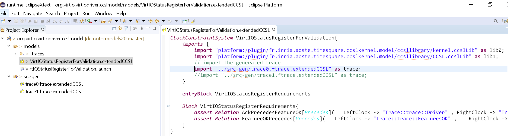

# Verifying the Conformance of a Driver Implementation to the VirtIO Specification (Proof of Concept)
This README explains the steps to reproduce the demonstration at the industrial track of DATE'21. The demonstration is organized as follows:
1. Compile a Linux kernel and patched it to generate the traces
2. Generate and extract the traces from the Linux kernel
3. Analyze the traces by using TimeSquare

## Compile the Linux Kernel
The first step is to get, patch and compile a Linux kernel to generate the traces. Please follow [here](https://www.collabora.com/news-and-blog/blog/2017/01/16/setting-up-qemu-kvm-for-kernel-development/) to get a copy of the Linux kernel that you can deploy as a Virtual Machine. Also, [here](http://nickdesaulniers.github.io/blog/2018/10/24/booting-a-custom-linux-kernel-in-qemu-and-debugging-it-with-gdb/) is another interesting tutorial.
When everything is set up, go to the Linux repository and modify `.config` to enable the following symbols: 

```bash
CONFIG_FUNCTION_TRACER=y
CONFIG_DYNAMIC_FTRACE=y
CONFIG_FUNCTION_GRAPH_TRACER=y
CONFIG_VIRTIO_BALLOON=m
```

Then, apply the patch that you can find at `patches` directory by doing:
```bash
git apply patches/addvirtiotrace.patch
```
Then, compile the kernel by doing `make -j8`. Once compilation is finished, execute the following commands to add the module `virtio_balloon.ko` to the disk image `qemu-image.img`, which has been generated in the previous step:

```bash 
sudo mount -o loop qemu-image.img ~/mountforqemu
cd linux/
cp drivers/virtio/virtio_balloon.ko ~/mountforqemu/
umount ~/mountforqemu
```

Launch the VM by executing:

```bash
qemu-system-x86_64 -kernel arch/x86/boot/bzImage -hda ../qemu-image.img -append "root=/dev/sda rw single console=ttyS0s" --enable-kvm --nographic -device virtio-balloon
```
**Ftrace** can be enabled to trace during booting time by adding the following parameters to the kernel command-line:

```bash
ftrace=function ftrace_filter=*virtio_*
```
## Generate the Traces
When you get the shell prompt, just execute:
```bash
cd /sys/kernel/debug/tracing
insmod /virtio_balloon.ko
less trace
```
You are going to get the output from ftrace:
```bash
insmod-218   [000] ....    85.178379: virtio_dev_probe: Driver
insmod-218   [000] ....    85.180762: virtio_dev_probe: FeaturesOK
insmod-218   [000] ....    85.185428: virtio_dev_probe: DriverOK
```
Note that this trace is generated without selecting a tracer. By doing this, it is possible to only see the calls to **trace_printk()**. To select a tracer that shows the different functions, execute:

```bash
echo function > current_tracer
```
To enable and disable the tracing, you have just to execute:
```bash
# to enable
echo 1 > tracing_on
# or to disable
echo 0 > tracing_on
```
To filter by function name, e.g., `do_page_fault`, execute:
```bash
echo do_page_fault > set_ftrace_filter
```

Note that the function must be in the file *available_filter_functions*. For example, to trace the *virtio_add_status()* function, execute:

```bash
echo function > current_tracer \
echo virtio_add_status > set_ftrace_filter \
echo 1 > tracing_on \
insmod /virtio_ballon.ko \
echo 0 > tracing_on
cat trace
```

In the Linux VirtIO driver, the first two steps of virtio-device initialization happen when the device is discovered but not when the module is loaded. This results that the two first steps of the initialization of a virtio-device are not in the trace. The kernel module finishes the initialization by negotiating the features and sending the `DriverOK` status bit. Select the traces and copy/paste them into a textual editor to use it latter. You can turn of the VM by doing `shutdown -h now`.

## Analyze the traces
We use an Eclipse workbench that contains TimeSquare to validate the generated traces. Please follow the steps at http://timesquare.inria.fr/download/ to install TimeSquare.  You also require XText to be able to import the traces. When this is done, import the following projects from the plugins directory:

- org.virtio.virtiodriver.ftracelanguage
- org.virtio.virtiodriver.ftracelanguage.ide
- org.virtio.virtiodriver.ftracelanguage.test
- org.virtio.virtiodriver.ftracelanguage.ui
- org.virtio.virtiodriver.ftracelanguage.ui.tests

This is a simple XText grammar to ease the importing of traces from ftrace. Launch a second instance of Eclipse and import the project org.virtio.virtiodriver.ccslmodel. In the following figure, you have at left the project that contains CCSL and ftraces files. At right, you have a textual editor of the ftrace trace. You can paste the traces in a `.ftrace` file.   


When a `.ftrace` is created or modified, this results in the generation of a `.extendedCCSL` file in the `src-gen`. This is the correct format to include a trace in a CCSL file. The file `VirtIOStatusRegisterForValidation.extendedCCSL` contains the translation of the VirtIO requirements by using CCSL.  This file also includes the trace that we want to validate. For example, in the next figure, we import the trace named `trace1.ftrace.extendedCCSL`, which is generated from `trace1.ftrace`.



To validate this sequence, right click on the CCSL specification named `VirtIOStatusRegisterForValidation.extendedCCSL`and then`Run As > CCSL Simulation`. The simulation is re-played by executing three steps of simulation. This corresponds with the steps in the trace. The console outputs the simulation of the specification and assert any violation if any. This triggers asserts when violations are found:


## Conclusions

In this demonstration, we have shown the use TimeSquare to validate traces generated from ftrace during the initialization of the virtio-driver from the the Linux kernel. We validate that the traces conform to the VirtIO specification that has been encoded by using CCSL. This example remains simple and has not addressed the case in which several instances of the same event occurs. We look forward to extended this work to other sections of the VirtIO specification and get the community familiar with the tooling and the language.