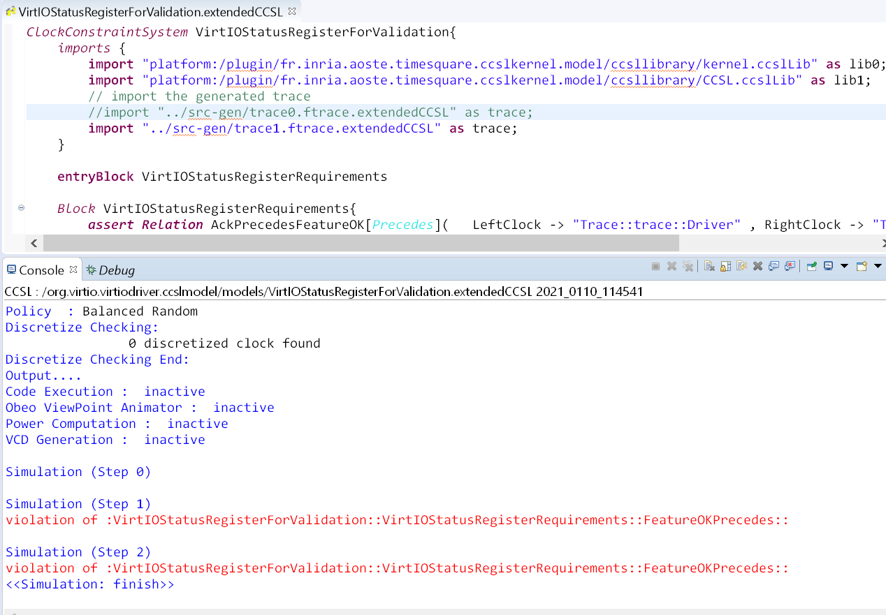
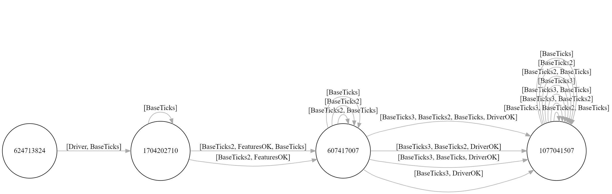

# DemoforModels20
This README explains the steps to reproduce the demonstration for the track **Demostration and Tools** at MODels'20 Conference. The demonstration is organized as followed:
1. Compile a Linux kernel and patched it to generate the traces
2. Generate and extract the traces from the Linux kernel
3. Analyze the traces by using TimeSquare
4. Get a state-space diagram from the CCSL specification of the VirtIO requirements.

Note that in this README we explain step by step how to reproduce the demonstration. During the conference, the demonstration may be shorter to match timing requirements. 

## Compile the Linux Kernel
The first step is to get, patch and compile a Linux kernel to generate the traces. Please follow [here](https://www.collabora.com/news-and-blog/blog/2017/01/16/setting-up-qemu-kvm-for-kernel-development/) to get a copy of the Linux kernel that you can deploy as a Virtual Machine. When everything is set up, go to the Linux repository and modify `.config` to enable the following symbols: 

	CONFIG_FUNCTION_TRACER=y
	CONFIG_DYNAMIC_FTRACE=y
	CONFIG_FUNCTION_GRAPH_TRACER=y
	CONFIG_VIRTIO_BALLOON=m

Then, apply the patch that you can find at `patches` directory by doing:

	git apply patches/addvirtiotrace.patch

Then, compile the kernel by doing `make -j8`. Once compilation is finished, execute the following commands to add the module `virtio_balloon.ko` to the disk image `qemu-image.img`, which has been generated in the previous step:

	sudo mount -o loop qemu-image.img ~/mountforqemu
	cd linux/
	cp drivers/virtio/virtio_balloon.ko ~/mountforqemu/
	umount ~/mountforqemu

Launch the VM by executing:

	qemu-system-x86_64 -kernel arch/x86/boot/bzImage -hda ../qemu-image.img -append "root=/dev/sda single console=ttyS0s" --enable-kvm --nographic -device virtio-balloon

## Generate the Traces
When you get the shell prompt, just execute:

	cd /sys/kernel/debug/tracing
	insmod /virtio_balloon.ko
	less trace

You are going to get the output from ftrace

	insmod-218   [000] ....    85.178379: virtio_dev_probe: Driver
	insmod-218   [000] ....    85.180762: virtio_dev_probe: FeaturesOK
	insmod-218   [000] ....    85.185428: virtio_dev_probe: DriverOK

Select these traces and paste them into a textual editor to use latter. You can turn of the VM by doing `shutdown -h now`.

## Analyze the traces
We use an Eclipse workbench that contains TimeSquare to validate the generated traces but also to analyze the CCSL specification of the VirtIO specification. Please follow the steps at http://timesquare.inria.fr/download/ to get an Eclipse with TimeSquare installed. 

The first step is to import the project `plugins/org.virtio.virtiodriver.ccslmodel` into the workbench. At left, you can see that the project contains two CCSL specifications. At right, you can see the textual editor of the CCSL specification. This is shown in the following figure: 

To validate the generated traces, we have to describe the traces in a format that CCSL understands them. For the moment, this is manually done. For example, the traces generated before are translated into the following code: 

        Sequence seqForDriver:IntegerSequence = (1);
        Sequence seqForFeaturesOK:IntegerSequence = (2);
        Sequence seqForDriverOK:IntegerSequence = (4);

The following picture shows how this is included into the CCSL specification. This corresponds with the sequence declared from line 15 to 17.

To validate this sequence, right click on the CCSL specification named `VirtIOStatusRegisterForValidation.extendedCCSL`and then`Run As > CCSL Simulation`. The console outputs the simulation of the specification and assert any violation if any. This sequence does not inform any violation. If we modify the trace as is shown in the following figure and re run the simulation, this triggers asserts when violations are found:

To generate the state-space diagram, right-click on `VirtIOStatusRegisterForStateSpace.extendedCCSL` and then `Timesquare > Generate LC` as is shown in the figure:

This generates the file `VirtIOStatusRegisterForStateSpace.dot`that contains the state-space diagram in DOT format. You can use any DOT viewer to display the diagram. For example, you can use https://dreampuf.github.io/GraphvizOnline/ and get something like:

You can find that shows these steps [here](https://youtu.be/TSvmjEfdQaw).